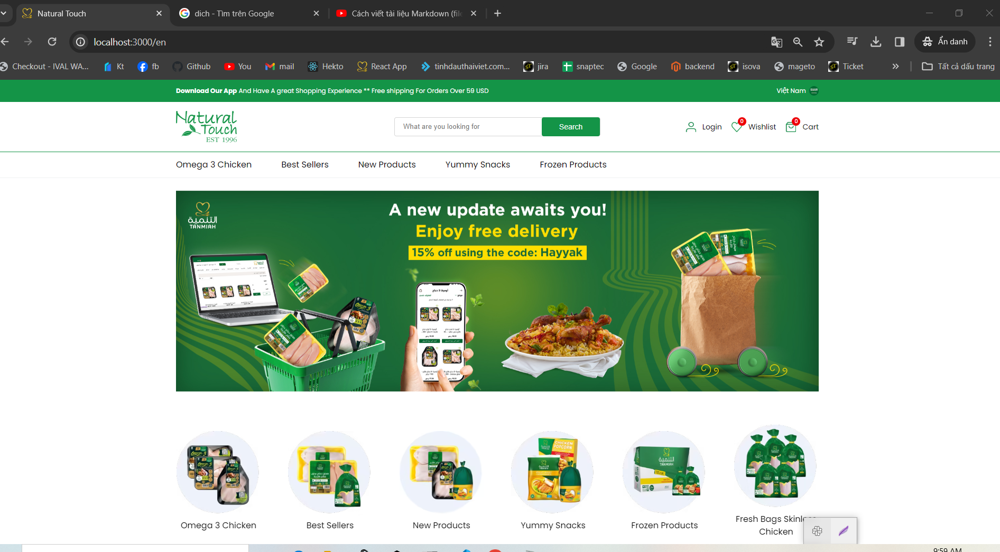
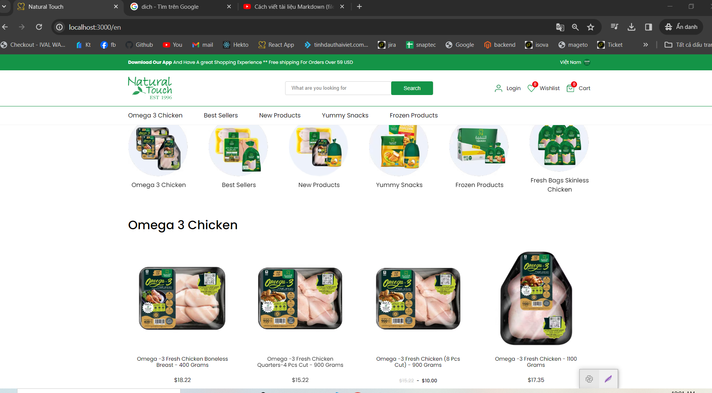

# Natural

## Table of contents

- [Introduction](#introduction)
- [Demo](#demo)
- [Run](#run)
- [Packages](#Packages)

## Introduction

A virtual e-commerce website using Node js, Express js, and Reactjs Nextjs.

NOTE: Please read the RUN section before opening an issue.

## Demo




The application has not been deployed for display in a real environment

on the backend side has been implemented

The website resembles a real store and you can add products to your cart and pay for them. If you want to try the checkout process, you can use the dummy card number provided by stripe for testing which is 4242 4242 4242 4242 with 11/24 expiration date, 123 CVC, and any zip codes. Please <u><b>DO NOT</b></u> provide real card number and data.

## Run

The application is divided into 2 parts

To run this application, you have to set your own environmental variables. For security reasons, some variables have been hidden from view and used as environmental variables with the help of dotenv package. Below are the variables that you need to set in order to run the application:

1. for Client(Front-End)

First, create a new `.env` file based on `.env.example` and change the value of `NEXT_PUBLIC_BACKEND_URL` to point to your version of "https://a-tuxl.onrender.com/", without having to run the server part code.

Install dependencies by running `npm install` or `yarn install`

Run the development server:

```bash
npm start
# or
yarn dev
```

2. for Server(Back-End)
   First, create a new `.env` file based on `.env.example` and change the value of:

- PORT: ""
- JWT_SECRET: jwt secret key
- CLOUD_NAME: cloud name of cloudinary
- API_KEY:cloudinary key
- API_SECRET: cloudinary api secret key
- STRIPE_SECRET: stripe's secret key
- STRIPE_ENDPOINT_SECRET:
- DB_NAME: name of the database
- DB_USERNAME: username of the database
- DB_PASSWORD: password of the database
- DB_HOST: host of the database

Install dependencies by running `npm install` or `yarn install`

Run the development server:

```bash
npm start
# or
yarn dev
```

### Packages

This repository includes the following packages:

1. client for Packages
   | Directory | Content |
   | :--------------------------- | :---------------------------------------------------------- |
   | `src/app/[lang]/` | Defined pages with React Functional Components |
   | `src/app/[lang]/layout.tsx` | Component used for initializing pages |
   | `src/pages/(marketing)/[product]/page.tsx` | Page that resolve URL and return specific page from backend |
   | `src/components/` | Project UI functional components |
   | `src/scss/` | Project global styles |
   | `src/network/apiClient/` | APIs that connect with Magento BE |
   | `src/network/apiServer/ ` | APIs that only run at server side |
   | `src/context/` | Project contexts |
   | `src/lang/` | Folder that supports multiple language |
   | `src/constants/` | Project configuration variables |
   | `src/redux/` | Redux configurations, defined actions and stores |
   | `src/utils/` | Utility functions |
   | `src/hooks/` | Some utilities but use React Hooks |
   | `next.config.js` | Custom advanced configuration of Next.js |
2. server for Packages
   | Directory | Content |
   | :--------------------------- | :---------------------------------------------------------- |
   | `src/pages/index.js` | Defined pages with Nodejs and router |
   | `src/config/` | where configuration applications are configured |
   | `src/controllers/` | where to write the controllers |
   | `src/migrations/` | |
   | `src/middlewares/` | nodejs middleware |
   | `src/models/` | models database |
   | `src/view/` | Folder that supports render ui |
   | `src/constants/` | Project configuration variables |
   | `src/routers/` | Supported route |
   | `src/utils/` | Utility functions |
   | `next.config.js` | Custom advanced configuration of Next.js |

- MIT License
- Copyright 2020 © [le van minh hoang](https://github.com/thanhmin34)
